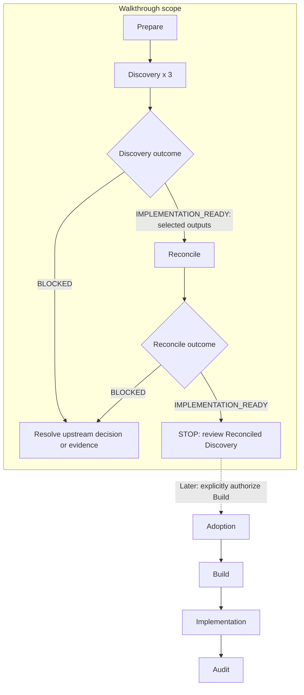
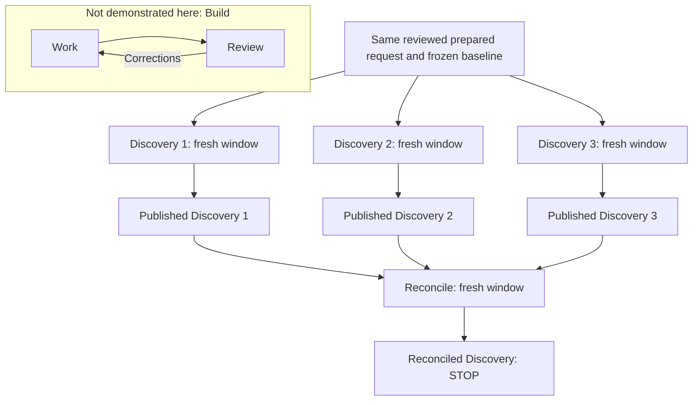

# A bounded Discovery walkthrough

Follow one synthetic bug through Prepare, three independent Discoveries, and Reconcile, then
stop. The target is a small Python function that raises `ZeroDivisionError` for an empty list.
The ticket requests `None` for that case and preserves non-empty averages.

The [synthetic ticket](../../examples/discovery/empty-average/ticket.md) and small target repository
are checked in as reusable inputs. Keep the prepared request, model outputs, and Orchestrate
store outside this checkout when following the procedure.

## Where this walkthrough stops



The diagram marks the walkthrough's scope. A blocked Discovery is a valid result but is excluded
from normal Reconcile. Reconcile requires at least two distinct finalized
`IMPLEMENTATION_READY` Discoveries; this walkthrough
uses the normal default of three. Reconcile can still publish `BLOCKED` if its selected outputs
leave a material issue unresolved. Neither lane agreement nor an evidence graph proves a solution
correct.

## What each window can see



The Discovery lanes are peers. They receive the same request and isolated source checkouts, and
do not read one another's results. Reconcile's engineering evidence is only the selected published
Discovery outputs; it does not reopen the repository. Frozen user constraints and actual
Reconcile-time user clarification retain their distinct authority. Build's Work ↔ Review loop
is a later workflow, not a relationship between Discovery lanes. Agreement does not establish
correctness.

## Prepare a disposable target

A live run needs Git, Python 3, an installed Orchestrate CLI and dispatchers, and a supported model
host (Codex, Claude Code, or Cursor) with its account and model access. See the
[installation guide](agent-installation.md). Each Discovery and Reconcile runs in a fresh model
window; this is a manual multi-window procedure, not one CLI command. Model sessions may incur
charges under the host's account. The temporary directory below separates trial files; it is not
a security sandbox.

From the Orchestrate checkout, create a separate Git repository and copy the synthetic seed:

```sh
WALKTHROUGH_DIR="$(mktemp -d "${TMPDIR:-/tmp}/orchestrate-walkthrough.XXXXXX")"
mkdir "$WALKTHROUGH_DIR/project" "$WALKTHROUGH_DIR/inputs"
cp examples/discovery/empty-average/average.py "$WALKTHROUGH_DIR/project/"
cp examples/discovery/empty-average/test_average.py "$WALKTHROUGH_DIR/project/"
cp examples/discovery/empty-average/.gitignore "$WALKTHROUGH_DIR/project/"
cp examples/discovery/empty-average/ticket.md "$WALKTHROUGH_DIR/inputs/ticket.md"
git -C "$WALKTHROUGH_DIR/project" init
git -C "$WALKTHROUGH_DIR/project" add .
git -C "$WALKTHROUGH_DIR/project" -c user.name="Walkthrough" \
  -c user.email="walkthrough@example.invalid" commit -m "Seed empty-average bug"
cd "$WALKTHROUGH_DIR/project"
python3 -m unittest -v
```

The seed intentionally leaves the bug present: expect one error (`ZeroDivisionError`) for empty
input and three passing non-empty checks. This is the investigation baseline, not a completed fix.
The synthetic ticket's acceptance applies to the later implementation, outside this walkthrough.
Keep the checkout at its seed commit throughout Discovery; experiments belong in each run's
scratch area. Record the absolute trial directory before opening other windows.

## Run Prepare, Discovery, and Reconcile

1. In a model window invoke `$prep-discovery-ticket`, supplying the absolute paths to
   `inputs/ticket.md` and `project/` in the trial directory, effort `empty-average`, and a separate
   store root such as `<absolute-trial-directory>/store`. The prepared request belongs beside
   the ticket in `inputs/`, outside both the target repository and store. Review it before
   Discovery; it must preserve the ticket verbatim.
2. Open three fresh model windows, each in the disposable target repository. Give each the same
   reviewed file with `$discovery "/absolute/trial/inputs/ticket.prepared.md"`. Replace that
   illustrative path with the actual path returned by Prepare. The skill initializes the frozen
   effort, prepares an isolated run, investigates, validates, and finalizes its output. Do not
   share another lane's conclusions. Answer actual questions in the window that asks them.
3. Save each run's ID, human source label, artifact ID, outcome, and published directory. If a
   material question remains unresolved, retain its `BLOCKED` output and resolve the reported
   upstream issue. Never pass that output to Reconcile. For this three-lane example, obtain three
   ready published outputs before continuing; later information needs a fresh Discovery rather
   than editing a finalized bundle or the frozen request.
4. In another fresh window, invoke `$reconcile` with the three exact ready published directories.
   It reads those public specifications and graphs, synthesizes a proposal, and publishes the
   Reconciled Discovery. Retain the effort ID, actual outcome, artifact ID, and absolute
   `reconciled-discovery.md` path.
5. Stop and read the result. For `IMPLEMENTATION_READY`, the remaining human decision is whether
   to proceed to Build preparation and explicitly authorize Build execution. For `BLOCKED`,
   resolve its reported decision or missing evidence upstream. This procedure ends before
   Adoption, Build, or Audit.

Orchestrate coordinates exact frozen inputs, isolated runs, structural validation, immutable
publication, and deterministic rendering of the reconciled contract. The models investigate and
synthesize. Dispatchers load version-matched guidance from the installed CLI when their operation
calls for it; editing this checkout does not update an installed binary. The Build dispatcher
has its separate non-executing boundary. No cost saving is established by this example.

## Inspect your result locally

In `reconciled-discovery.json`, follow a binding requirement's `source_refs` to the named
Discovery artifact and graph node. Follow that node's `depends_on` links to its Findings and
recorded authority. Each Finding's `verification` identifies inspection, corroboration, or an
experiment; read its observations and limitations before treating it as support for the remedy.
Baseline reproduction does not prove a future fix works, and a few test examples do not prove
the entire input domain. Technical suggestions remain advisory.

Keep the original store outside the repository for later inspection. `orchestrate inspect
--effort <effort> --artifact <artifact>` verifies and reads a registered bundle in that store.
Existing commands do not validate an arbitrary standalone copied directory. Editing bundle
contents invalidates their original manifest hashes. Record versions and model settings locally
if you want to compare runs; matching prose is not expected.

## When to use this shape

A bounded bug fits when the desired behavior and exclusions are clear and investigation can
establish the relevant current behavior. Independent runs can then expose evidence, assumptions,
and limitations before implementation. Broader feature planning is more useful when the product
behavior, boundaries, or compatibility choices first need exploration; do not force those choices
into this bug's narrow template.

The [Chat Discovery guide](../chat-discovery.md) offers a collaborative single-conversation
alternative. It does not supply independent Discovery lanes and is not a substitute for the
three-run evidence required by this walkthrough.
